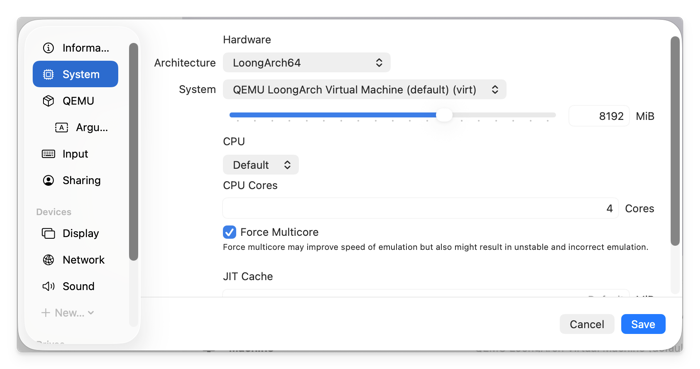
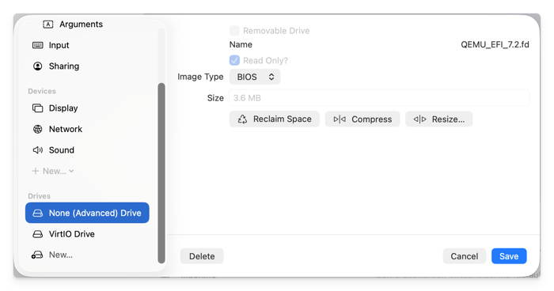
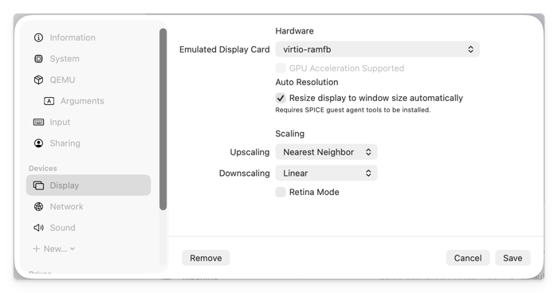

LoongArch64 has an awkward bit of history: the ecosystem is often described as split between ["old world" (旧世界) and "new world" (新世界)](https://bbs.loongarch.org/d/89). For the kind of server images I care about here, especially KylinOS Server and UnionTech OS Server, the practical target is still old-world compatibility.

That is why the firmware file matters. A newer LoongArch64 UEFI build is not automatically better for these guests. For this workflow, `QEMU_EFI_7.2.fd` is the boringly useful choice: old enough to match the systems being installed, but still aligned with QEMU's LoongArch64 support era.

I have shared my copy here:

- [Google Drive](https://drive.google.com/file/d/1vRSzI4OjPD0IypBUrJoMh29qLbEsbs4u/view?usp=sharing)
- [Baidu Netdisk](https://pan.baidu.com/s/1oovDcQMkYibFoRYQo-JfoQ?pwd=jxbd)

The file I am using is 3,801,088 bytes. Its SHA256 checksum is:

```text
59ab6e18af0ca75ff1556ebb4b6ad640ffbf09499710e655172254f93a2d63ba
```

You can verify it after downloading:

```bash
shasum -a 256 QEMU_EFI_7.2.fd
```

> [!NOTE]
>
> This post is about full-system emulation, not native virtualisation. On an x86_64 or Apple Silicon host, LoongArch64 can be quite slow. If a guest has not reached the installer or booted system after a long time, the problem may be firmware, guest compatibility, or host QEMU support rather than just patience.



{}

### Install QEMU

On macOS, Homebrew is the easiest way to install QEMU:

```bash
brew install qemu
qemu-system-loongarch64 --version
qemu-system-loongarch64 -machine help
qemu-system-loongarch64 -cpu help
```

On Linux, install the package that provides `qemu-system-loongarch64`. For example, on a Fedora-like host:

```bash
dnf install -y qemu-system-loongarch64 qemu-img
```

QEMU 7.2 or newer is strongly preferred. QEMU 7.1 introduced initial LoongArch support, and QEMU 7.2 included important updates. In practice, I would not spend time debugging old QEMU builds for this.

UTM is worth knowing about on macOS because it is a pleasant QEMU-based VM manager. It can emulate a LoongArch64 VM, so the point is not that UTM is unavailable. For this old-world cloud-image workflow, though, I still prefer the direct `qemu-system-loongarch64` command because the firmware, device, monitor, and forwarding options are easier to reproduce exactly.

### Prepare the files

Create a working directory:

```bash
mkdir -p ~/VMs/loongarch64
cd ~/VMs/loongarch64
```

Put these files in that directory:

- `QEMU_EFI_7.2.fd`, downloaded from one of the cloud-drive links above.
- A LoongArch64 server ISO, such as KylinOS Server or UnionTech OS Server.
- A qcow2 disk created for the VM.

Create the disk with `qemu-img`:

```bash
qemu-img create -f qcow2 KylinOS-Server-loongarch64.qcow2 40G
```

Adjust the filename and size for your own guest. These systems are Red Hat-like, so a 40 GB disk is a reasonable starting point for a small build or image-preparation VM.

### Boot from an ISO

Use this shape when installing a fresh LoongArch64 server guest from an ISO:

```bash
qemu-system-loongarch64 \
  -M virt \
  -bios QEMU_EFI_7.2.fd \
  -cdrom KylinOS-Server-loongarch64.iso \
  -chardev socket,id=qemu-ga.0,path=qemu-ga.sock,server=on,wait=off \
  -cpu la464-loongarch-cpu \
  -device nec-usb-xhci,id=xhci,addr=0x1b \
  -device usb-kbd,id=keyboard,bus=xhci.0,port=2 \
  -device usb-tablet,id=tablet,bus=xhci.0,port=1 \
  -device virtio-gpu-pci \
  -device virtio-serial \
  -device virtserialport,chardev=qemu-ga.0,name=org.qemu.guest_agent.0 \
  -hda KylinOS-Server-loongarch64.qcow2 \
  -m 2G \
  -monitor telnet:localhost:5555,server=on,wait=off \
  -net nic,model=virtio \
  -net user,hostfwd=tcp::10000-:22 \
  -smp 2 \
  -vnc 0.0.0.0:1
```

For UnionTech OS Server, keep the same command structure and replace the ISO and qcow2 filenames. The main point is not the exact distribution name; it is the combination of `qemu-system-loongarch64`, `-M virt`, `QEMU_EFI_7.2.fd`, `la464-loongarch-cpu`, VirtIO devices, VNC, QEMU Guest Agent wiring, and SSH port forwarding.

Connect with a VNC viewer to the host's display `:1`, which normally means TCP port `5901`. If you add `--serial stdio`, QEMU will also print serial output in the terminal, which can be useful when the graphical display is quiet.

During installation, treat the guest as a Red Hat-like system:

- Use VirtIO-backed disk and network devices.
- Install or keep `qemu-guest-agent` if the image-preparation workflow needs guest-agent operations later.
- Ensure SSH is installed and enabled if you want to log in through the forwarded host port.
- Keep the firmware file and qcow2 disk together so the boot command stays reproducible.

### Boot an installed qcow2

After installation, stop the emulation session and boot from the qcow2 disk without `-cdrom`:

```bash
qemu-system-loongarch64 \
  -M virt \
  -bios QEMU_EFI_7.2.fd \
  -chardev socket,id=qemu-ga.0,path=qemu-ga.sock,server=on,wait=off \
  -cpu la464-loongarch-cpu \
  -device nec-usb-xhci,id=xhci,addr=0x1b \
  -device usb-kbd,id=keyboard,bus=xhci.0,port=2 \
  -device usb-tablet,id=tablet,bus=xhci.0,port=1 \
  -device virtio-gpu-pci \
  -device virtio-serial \
  -device virtserialport,chardev=qemu-ga.0,name=org.qemu.guest_agent.0 \
  -hda KylinOS-Server-loongarch64.qcow2 \
  -m 2G \
  -monitor telnet:localhost:5555,server=on,wait=off \
  -net nic,model=virtio \
  -net user,hostfwd=tcp::10000-:22 \
  -smp 2 \
  -vnc 0.0.0.0:1
```

Then SSH through the forwarded port:

```bash
ssh root@localhost -p 10000
```

If the guest has no network, first use VNC or serial output to inspect it:

```bash
ip addr
systemctl status sshd
systemctl status qemu-guest-agent
```

On KylinOS Server or UnionTech OS Server, the package-management commands should feel familiar if you have used RHEL-like systems:

```bash
dnf install -y openssh-server qemu-guest-agent
systemctl enable --now sshd qemu-guest-agent
```

### Use QEMU Monitor

The `-monitor telnet:localhost:5555,server=on,wait=off` option opens a QEMU Monitor endpoint. Connect to it from the host:

```bash
telnet localhost 5555
```

Common monitor commands:

```text
info status
info block
system_powerdown
system_reset
quit
```

`system_powerdown` is the polite option if the guest supports ACPI shutdown. `quit` stops QEMU directly and can lose guest data, so I only use it when the VM is disposable or already stuck.

For more monitor commands, see the [QEMU Monitor documentation](https://www.qemu.org/docs/master/system/monitor.html).

### Confirm the architecture

Inside the guest:

```bash
uname -m
uname -a
```

The first command should print:

```text
loongarch64
```

At that point the VM is ready for the usual Red Hat-like server chores: package updates, qemu-guest-agent checks, image clean-up, kernel clean-up, and whatever build or compatibility work needed a LoongArch64 environment in the first place.

### Optional: use UTM on macOS

If you prefer a GUI, UTM can be configured for this kind of VM as well. I would treat it as a convenience path rather than the main recipe, because the command line is easier to copy, audit, and rerun during image work.

The important system settings are:

- Architecture: `LoongArch64`.
- System: `QEMU LoongArch Virtual Machine (default) (virt)`.
- CPU: `Default`, or the closest available LoongArch CPU setting exposed by your UTM build.
- Memory and CPU cores: choose values that match your host. LoongArch64 emulation is slow, and checking `Force Multicore` may help sometimes.



Add `QEMU_EFI_7.2.fd` as a drive with image type `BIOS`, and keep it read-only.



For display, `virtio-ramfb` is a useful starting point.



You still need the same guest-side checks after installation: SSH, `qemu-guest-agent` if required, VirtIO networking, and `uname -m` showing `loongarch64`.

{}
