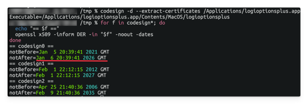

> "When we are born, we cry that we are come to this great stage of fools."

The year 2026 kicked off with a bold statement: "What if time... just stopped working?"

First, League of Legends players around the world found themselves locked out for hours because an SSL certificate quietly expired. No dragons, no Baron, just TLS saying nope.

Then, not wanting to be left out, Logitech decided to add some cross-industry solidarity. As shown in the screenshot, Logi Options+ on macOS strikes. Purple screen with a loading circle. No mouse customisation enlightenment. 😇


Digging a little deeper, the issue turns out to be painfully familiar: a certificate expired at exactly the start of 2026.

```sh
codesign -d --extract-certificates /Applications/logioptionsplus.app
for f in codesign*; do
  echo "== $f =="
  openssl x509 -inform DER -in "$f" -noout -dates
done
```



macOS, being very strict about reality, looks at the clock, looks at the certificate, and says: "This app lives in the past. I refuse." 🧐

Until Logitech remembers how calendars work, the workaround is gloriously low-tech. Just tweak the system time to the time before 20:39 GMT on 6 Jan 2026. It may also be necessary to restart the Logi Plugin Service. After that, congratulations for successfully debugging time!

So here we are, early 2026:

- Gamers defeated by certificates.
- An utility app halted by GMT.
- Engineers everywhere muttering: "How did this pass CI?"

What's next? 😈

Anyway, happy New Year! Of course, don't forget to renew your certificates. ⏰
