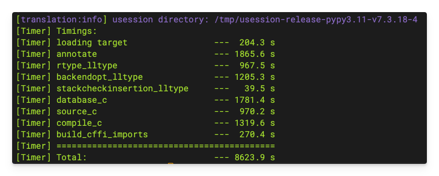

[PyPy's official documentation](https://doc.pypy.org/en/latest/build.html) provides general guidance on building from its source. Since PyPy does not support Linux LoongArch64 officially, I would like to share my practice to build a binary for this relatively new architecture.

> [!NOTE]
>
> 1. The following is demonstrated with the root user in a LoongArch64 VM running Kylin Server V10 SP3. Adjustments may be required to match your env.
> 2. PyPy 3.11 v7.3.18 is used. Other PyPy 3 versions can follow a similar way.

In particular, I should stress that this OS version leverages old-world[^1] technologies.



{}

### Prerequisites: Python 2.7 and at least 6 GB memory for translation

As the official documentation states, the translation process is indeed RAM-hungry. So please take it seriously.

The documentation also mentions that CPython/PyPy 2.7 is required. Building PyPy 2.7 for LoongArch64 can be unworthy. Hence, I'll just install Python 2.7 in my VM.

```bash
dnf install -y python2
# command -v python2
```

### Get the source

```bash
wget https://downloads.python.org/pypy/pypy3.11-v7.3.18-src.tar.bz2
tar -xvf pypy3.11-v7.3.18-src.tar.bz2
# rm -f pypy3.11-v7.3.18-src.tar.bz2

# Apply patches here.
```

> [!IMPORTANT]
>
> Patches must be applied to support LoongArch64. You may refer to [one of my GitHub repo](https://github.com/ArvinZJC/pypy/tree/dev).

### Install build-time dependencies

```bash
dnf install -y bzip2-devel expat-devel gc-devel gcc gdbm-devel libffi-devel make ncurses-devel openssl-devel pkgconfig python2-pip sqlite-devel tk-devel xz-devel zlib-devel
```

CFFI is required. A Python 2.7 virtual env is suggested.

```bash
# python2 -m pip -V
python2 -m pip install virtualenv
python2 -m virtualenv venv_2
source venv_2/bin/activate
# command -v python
# python -m pip -V
python -m pip install cffi
```

### Translate without JIT

```bash
cd pypy3.11-v7.3.18-src/pypy/goal
python ../../rpython/bin/rpython --opt=2
deactivate
```

It can be time-consuming. Please be patient. You can receive the following output for a successful build.



After a successful build, you can also play with the compiled binary.

```bash
./pypy3.11-c -V
./pypy3.11-c -c 'print("Hello World!")'
./pypy3.11-c -m pip -V
```

### Packaging

Let me directly use the compiled binary to do packaging.

```bash
# ./pypy3.11-c ../../pypy/tool/release/package.py --help
./pypy3.11-c ../../pypy/tool/release/package.py --archive-name=pypy3.11-v7.3.18-loongarch64
```

> This creates a clean and prepared hierarchy, as well as a `.tar.bz2` with the same content; the directory to find these will be printed out.

{}

[^1]: You may refer to [a post in LA UOSC](https://bbs.loongarch.org/d/89) for a brief intro on the so-called old/new world.
